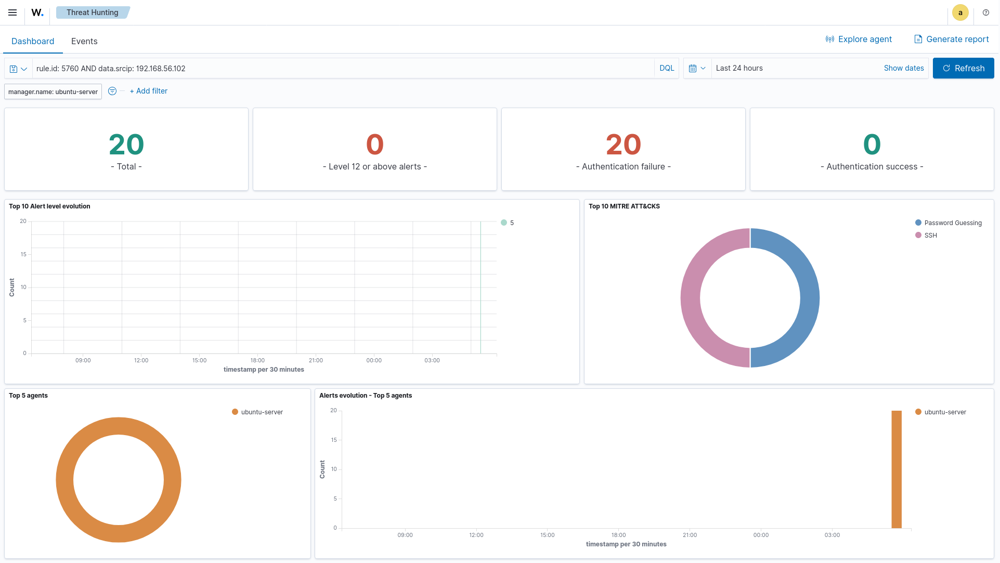
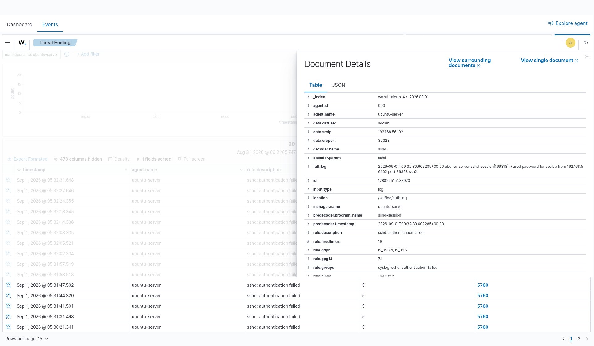
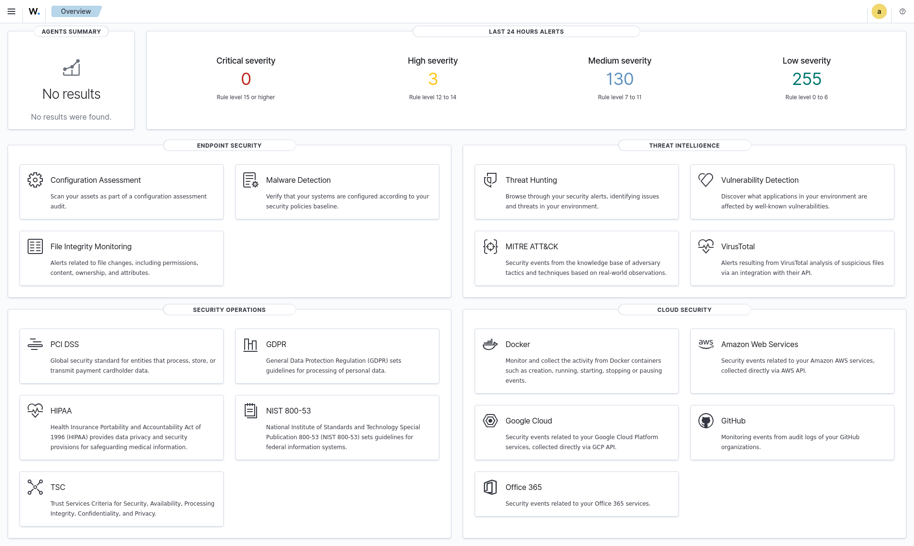
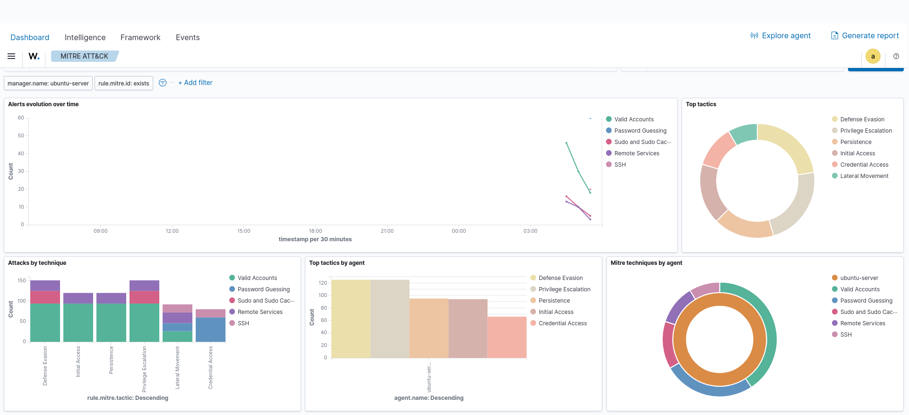
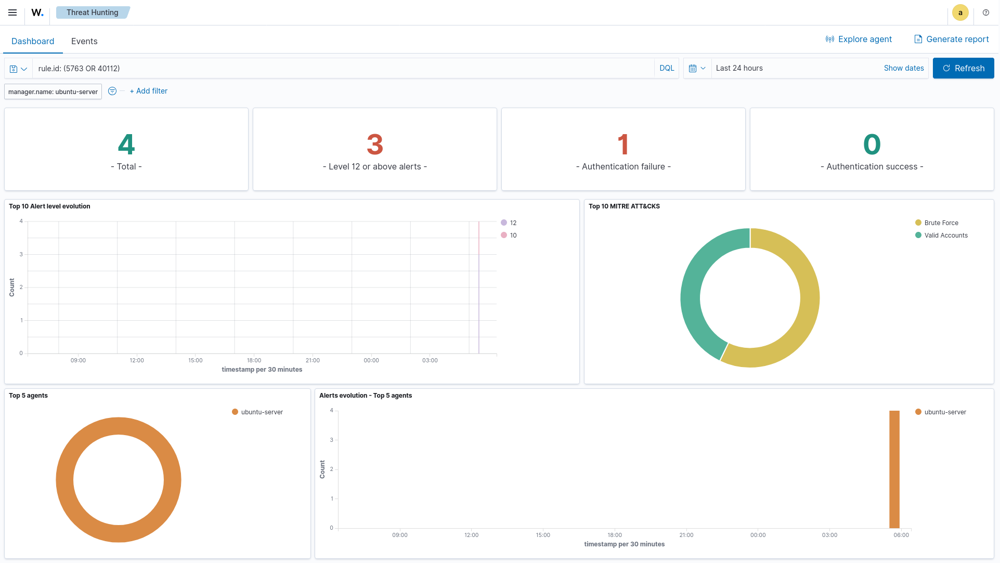

# Informe de Incidente — Fuerza Bruta SSH

| Campo | Valor |
|---|---|
| Título | Fuerza bruta SSH contra ubuntu-server con acceso exitoso posterior |
| Fecha/hora | 2026-09-01 09:30:09 UTC – 09:32:31 UTC |
| Severidad | **Alta** — se confirmó acceso exitoso desde la IP atacante |
| Analista | Bryan Acanda Gonzalez — Bootcamp Ciberseguridad, Neoland |
| Fuente de detección | Wazuh 4.14.7 — rules 5760, 5763, 5551, 5715, 40112, 100010 — /var/log/auth.log |
| IP origen | 192.168.56.102 (Kali Linux) |
| Sistema afectado | ubuntu-server — 192.168.56.103 |
| Cuentas objetivo | soclab |
| Fallos observados | 22 intentos fallidos de autenticación SSH |
| Accesos exitosos | **Sí** — soclab a las 2026-09-01T09:30:41 UTC (rule 5715 + correlación 40112/100010) |

---

## 1. Resumen ejecutivo

El 2026-09-01 entre las 09:30:09 y las 09:32:31 UTC, Wazuh registró 22 intentos fallidos de autenticación SSH contra el host `ubuntu-server` (192.168.56.103), originados desde la IP `192.168.56.102`. Los intentos afectaron exclusivamente a la cuenta `soclab`. A las 09:30:41 UTC se detectó un acceso exitoso desde la misma IP atacante mediante la misma cuenta (rule 5715), lo que disparó la alerta de correlación de nivel 12 (rules 40112 y 100010). El incidente se clasifica como **Alta** severidad al confirmarse compromiso de credenciales y acceso interactivo al sistema.

---

## 2. Alcance

- **Host objetivo:** ubuntu-server / 192.168.56.103
- **Usuario atacado:** soclab
- **Fuente de logs:** /var/log/auth.log (monitorizado por Wazuh Manager)
- **Periodo analizado:** 2026-09-01T09:30:09 UTC – 2026-09-01T09:32:31 UTC
- **Entorno:** Laboratorio controlado — red Host-Only aislada (192.168.56.0/24)

---

## 3. Hallazgos

- **Total fallos SSH:** 22 intentos fallidos contra la cuenta `soclab`
- **IP origen principal:** 192.168.56.102
- **Cuenta atacada:** soclab (usuario válido del sistema)
- **Primer evento registrado:** 2026-09-01T09:30:09 UTC
- **Último fallo registrado:** 2026-09-01T09:32:31 UTC
- **Acceso exitoso:** Sí
  - Usuario: `soclab`
  - Timestamp: `2026-09-01T09:30:41 UTC`
  - Puerto origen: 34804
  - Rule: 5715 (nivel 3) — confirmado por correlación rule 40112 y rule 100010 (nivel 12)

---

## 4. Línea temporal

| Timestamp (UTC) | IP Origen | Evento | Rule | Nivel |
|---|---|---|---|---|
| 2026-09-01T09:30:09 | 192.168.56.102 | Failed password for soclab | 5760 | 5 |
| 2026-09-01T09:30:11 | 192.168.56.102 | Failed password for soclab | 5760 | 5 |
| 2026-09-01T09:30:15 | 192.168.56.102 | Failed password for soclab | 5760 | 5 |
| 2026-09-01T09:30:17 | 192.168.56.102 | Failed password for soclab | 5760 | 5 |
| 2026-09-01T09:30:19 | 192.168.56.102 | Failed password for soclab | 5760 | 5 |
| 2026-09-01T09:30:21 | 192.168.56.102 | Failed password for soclab | 5760 | 5 |
| **2026-09-01T09:30:41** | 192.168.56.102 | **Accepted password for soclab** | **5715** | **3** |
| 2026-09-01T09:31:31 | 192.168.56.102 | Failed password for soclab | 5760 | 5 |
| **2026-09-01T09:31:34** | 192.168.56.102 | **PAM: Multiple failed logins** | **5551** | **10** |
| **2026-09-01T09:31:36** | 192.168.56.102 | **Brute force trying to get access** | **5763** | **10** |
| 2026-09-01T09:31:41 – 09:32:31 | 192.168.56.102 | Failed password for soclab ×13 | 5760 | 5 |
| **2026-09-01T09:32:57** | 192.168.56.102 | **Multiple auth failures + success** | **40112 / 100010** | **12** |

---

## 5. Análisis técnico

### Filtros DQL utilizados en Wazuh

```
# Fallos SSH del incidente
rule.id: (5760 OR 5763 OR 5551) AND data.srcip: "192.168.56.102"

# Login exitoso desde IP atacante
rule.id: 5715 AND data.srcip: "192.168.56.102"

# Alertas de correlación (fuerza bruta + éxito)
rule.id: (40112 OR 100010)

# Timeline completo
rule.id: (5760 OR 5763 OR 5551 OR 5715 OR 40112 OR 100010) AND data.srcip: "192.168.56.102"
```

### Campos extraídos de los eventos

| Campo | Valor |
|---|---|
| data.srcip | 192.168.56.102 |
| data.dstuser | soclab |
| rule.groups | authentication_failed, sshd, brute_force |
| rule.mitre.id | T1110, T1110.001, T1078 |

### Razonamiento del analista

El patrón observado es consistente con un ataque de fuerza bruta de diccionario manual o semi-automatizado. El atacante conocía previamente el nombre de usuario `soclab` (no se observaron intentos con usuarios inexistentes), lo que indica reconocimiento previo o conocimiento interno.

El éxito del ataque se produjo en la primera oleada (09:30:41 UTC), antes de que Wazuh alcanzara el umbral de alerta de fuerza bruta (rule 5763 a las 09:31:36 UTC). Esto evidencia una ventana de exposición de aproximadamente **2 minutos** entre el inicio del ataque y la detección formal, durante la cual el acceso ya se había producido.

La regla de correlación personalizada `100010` (equivalente a la nativa `40112`) detectó correctamente el patrón completo: múltiples fallos desde la misma IP seguidos de un login exitoso en una ventana de 300 segundos.

---

## 6. Mapeo MITRE ATT&CK

| Elemento | Valor | Justificación |
|---|---|---|
| Táctica | Credential Access | El atacante intentó y obtuvo credenciales válidas |
| Técnica | T1110 – Brute Force | Múltiples intentos sistemáticos de autenticación SSH |
| Subtécnica | T1110.001 – Password Guessing | Contraseñas variadas contra un usuario conocido |
| Táctica secundaria | Initial Access | Acceso al sistema mediante credencial comprometida |
| Técnica secundaria | T1078 – Valid Accounts | Uso de cuenta legítima `soclab` tras el ataque |

---

## 7. Impacto

El ataque tuvo éxito. El acceso mediante `soclab` otorgó al atacante una sesión interactiva en el sistema con los privilegios de dicho usuario. En un entorno real, el impacto potencial incluiría:

- **Acceso a datos del usuario `soclab`** y cualquier recurso accesible con sus permisos
- **Lateral movement** si el usuario tiene acceso a otros sistemas o claves SSH almacenadas
- **Persistencia** mediante instalación de backdoors, cron jobs o claves SSH autorizadas
- **Escalada de privilegios** si el sistema presenta vulnerabilidades locales

La severidad se clasifica como **Alta** dado que el compromiso fue efectivo y generó acceso interactivo al sistema.

---

## 8. Recomendaciones

- [ ] **Deshabilitar autenticación SSH por contraseña** — usar exclusivamente claves SSH (`PasswordAuthentication no` en sshd_config)
- [ ] **Rotar inmediatamente la contraseña de `soclab`** y auditar la actividad de la cuenta tras el acceso
- [ ] **Implementar Fail2ban** para bloquear automáticamente IPs tras N fallos consecutivos
- [ ] **Revisar si `soclab` necesita acceso SSH remoto** — si no es necesario, restringirlo
- [ ] **Implementar MFA** o acceso mediante VPN/bastion host para SSH
- [ ] **Afinar umbral de detección** — la rule 5763 disparó 87 segundos después del primer fallo; considerar reducir el umbral para detección más temprana
- [ ] **Configurar alertas en tiempo real** hacia un canal de comunicación (email, Slack) para niveles ≥ 10
- [ ] **Revisar si hay claves SSH no autorizadas** añadidas en `~/.ssh/authorized_keys` de soclab tras el acceso

---

## 9. Evidencias

| ID | Descripción | Archivo |
|---|---|---|
| EV-01 | 20 fallos SSH detectados — MITRE Password Guessing | evidencias/01-failed-attempts.png |
| EV-02 | Document Details — srcip, dstuser, full_log, location | evidencias/02-source-ip.png |
| EV-03 | Overview dashboard — 3 High + 150 Medium severity | evidencias/03-dashboard-overview.png |
| EV-04 | MITRE ATT&CK — T1110.001 Password Guessing + T1078 Valid Accounts | evidencias/04-mitre-attack.png |
| EV-05 | Detección fuerza bruta — rules 5763/40112 nivel 10/12 | evidencias/05-brute-force-detection.png |
| EV-06 | Regla personalizada 100010 | detecciones/local_rules.xml |

### EV-01 — Fallos SSH detectados



### EV-02 — IP origen y campos del evento



### EV-03 — Overview de alertas



### EV-04 — MITRE ATT&CK



### EV-05 — Detección fuerza bruta (rules 5763 / 40112)



---

*Informe generado en entorno de laboratorio controlado. Todos los sistemas son propiedad del analista. Datos de red corresponden a red Host-Only aislada sin conectividad externa.*
